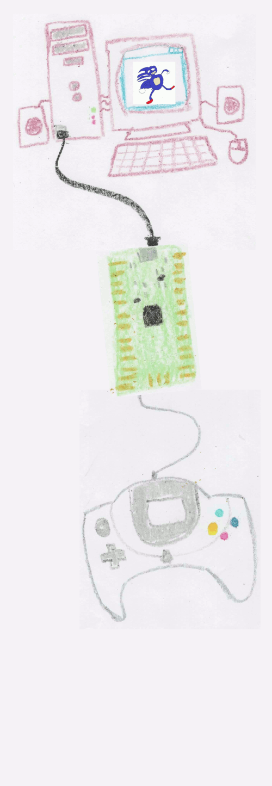
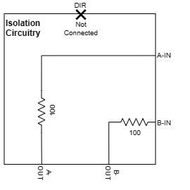
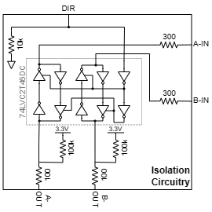

# DreamcastControllerUsbPico

Using a Raspberry Pi Pico, DreamcastControllerUsbPico enables USB interfacing with a Dreamcast or its controllers and peripherals, functioning in either host mode or client mode as depicted below.

| Host Mode | Client Mode |
| -------- | ------- |
|  |  |

This platform may easily be forked and adapted for other interfacing needs. Feel free to do so under the conditions of the supplied [LICENSE.md](LICENSE.md).

Refer to the [releases](https://github.com/OrangeFox86/DreamcastControllerUsbPico/releases) page for current progress. Refer to the [issues](https://github.com/OrangeFox86/DreamcastControllerUsbPico/issues) tab for things left to be implemented and known bugs.

---

# General Disclaimer

Proceed at your own risk! I am not liable for any damage that may occur due to the use of any provided schematics, firmware, or any other recommendations made within this project (see [LICENSE.md](LICENSE.md)). There is risk of damage to any attached hardware (ex: USB port, Dreamcast peripheral, or Dreamcast) if circuitry is improperly handled.

---

# Quick Installation Guide

## Connecting the Hardware for Host Mode

Host mode allows you to connect up to 4 Dreamcast controllers to a PC over USB. This is compatible with the [flycast](https://github.com/flyinghead/flycast) emulator which will communicate with an attached VMU's screen and jump pack. See [this wiki article](https://github.com/OrangeFox86/DreamcastControllerUsbPico/wiki/DreamcastControllerUsb-plus-Flycast-equals-%E2%9D%A4%EF%B8%8F) for help on how to setup flycast for use with this project.

<p align="center">
  
</p>

Refer to the [Isolation Circuitry](#isolation-circuitry) and [Dreamcast Controller Pinout](#dreamcast-controller-pinout) below.

## Connecting the Hardware for Client Mode

Client mode emulates a single controller for use with a Dreamcast. This was added in as an extra feature for this project mainly to demonstrate that the MapleBus library may be used in either direction. Currently this mode only supports a single DualShock4 controller plugged into the USB port at bootup (hot-plug not supported, micro-USB OTG cable required).

<p align="center">
  
</p>

Refer to the [Isolation Circuitry](#isolation-circuitry) and [Dreamcast Controller Pinout](#dreamcast-controller-pinout) below.

## Isolation Circuitry

Select the appropriate isolation circuitry for your needs.

### Option 1



Select the highest tolerable resistance for each resistor (usually around 100 ohms, but **you may need to go as low as 50 ohms to support an Arcade Stick**). This implementation is simple but has the following drawbacks.
- There isn't a resistance low enough which the interface can tolerate and high enough that would prevent damage to the RP2040 if more than one line (total) experienced a fault for an extended amount of time
- The RP2040 doesn't have over-voltage tolerant inputs, so accidental shorting to the 5V line will cause damage
- Hot-swapping should be avoided

### Option 2



This option completely isolates the Maple Bus I/O from the RP2040 at the expense of being more complex and less accessible to DIYers. I highly recommend this or something like this for any commercial application. Select a 2-bit bus transceiver which satisfies the following.
- Must support at least 50 mA on each output
- Must NOT have latched outputs

The chip number `74LVC2T45DC` made by Texas Instruments or Nexperia satisfies these requirements (found on digikey.com or mouser.com).

## Dreamcast Controller Pinout

For reference, the following is the pinout for the Dreamcast controller port. Take note that many other sources found online refer to one of the ground pins as a connection sense, but the Dreamcast controller port module has both of these ground pins hard wired together. As such, this project's host mode operation doesn't rely on any such hardware sense line. Instead, the detection of a connected device is performed by polling the bus until a response is received, just as a real Dreamcast would.

<p align="center">
  
</p>

## Selecting the Appropriate Binary

Each [release](https://github.com/OrangeFox86/DreamcastControllerUsbPico/releases) will contain multiple uf2 files. Currently, there are 3 flavors of these binaries.

- **host-1p.uf2**: [Host mode](#connecting-the-hardware-for-host-mode) configuration, only `1P` active - all operating systems support this
- **host-4p.uf2**: [Host mode](#connecting-the-hardware-for-host-mode) configuration, `1P`, `2P`, `3P`, and `4P` active - this is more problematic when used on Windows as controllers won't properly enumerate
- **client-with-usb-host.uf2**: [Client mode](#connecting-the-hardware-for-client-mode) configuration supporting a single Dualshock4 controller connected to the USB port

## Loading the UF2 Binary

Hold the BOOTSEL button on the Pico while plugging the USB connection into your PC. A drive with a FAT partition labeled RPI-RP2 should pop up on your system. Open this drive, and then copy the desired uf2 file for either host or client operation here. The Pico should then automatically load the binary into flash and run it. For more information, refer to the official [Raspberry Pi Pico documentation](https://www.raspberrypi.com/documentation/microcontrollers/raspberry-pi-pico.html#documentation).

## Helpful Tips

### Host Mode Tips

- The LED on the Pico board may be used for quick status - when connected to USB, it should remain on when no button is pressed on any controller and turn off once a button is pressed.
- The included file `formatted_storage.bin` may be used to delete and format a VMU attached to a controller when this project is used in host mode. For example, rename this file vmu0.bin and copy to DC-Memory drive when a VMU is inserted into the upper slot of Player 1's controller.
- A serial device shows up on the PC once attached - open serial terminal (BAUD and other settings don't matter), type `h`, and then press enter to see available instructions.

---

# Build Instructions (for Linux and Windows)

If running under Windows, install [WSL](https://docs.microsoft.com/en-us/windows/wsl/install) and your desired flavor of Linux. I recommend using Ubuntu 22.04 as that is what I have used for development. Then the steps below may be run within your WSL instance.

1. Install git, cmake, and gcc-arm-none-eabi compiler by running the following commands
```bash
sudo apt update
sudo apt -y install git cmake gcc-arm-none-eabi
```

2. (optional) In order to run and debug tests, install standard gcc compilers and gdb by running the following
```bash
sudo apt -y install build-essential gdb
```

3. Clone this repo then cd into the created directory
```bash
git clone https://github.com/Tails86/DreamcastControllerUsbPico.git
cd DreamcastControllerUsbPico
```

4. Pull down the pico SDK (this project now uses a fork of the SDK - it will no longer compile under the standard SDK)
```bash
git submodule update --recursive --init
```
Hint: if you have issues building, the easiest way to correct any submodule synchronization issue is to delete the `ext/pico-sdk` directory (ex: `rm -rf ext/pico-sdk`), and then re-run the above submodule update command.

5. (optional) Build and run tests - this runs core lib unit tests locally
```bash
./run_tests.sh
```

6. Execute the build script
```bash
./build.sh
```

After build completes, binaries should be located under `dist/`. Pre-built release binaries may be found [here](https://github.com/OrangeFox86/DreamcastControllerUsbPico/releases).

This project may be opened in vscode. In vscode, the default shortcut `ctrl+shift+b` will build the project. The default shortcut `F5` will run tests with gdb for local debugging. Open the terminal tab after executing tests with debugging to see the results.

---

# Maple Bus Implementation

The Maple Bus is a serial communications protocol which Dreamcast uses to communicate with controllers and other peripherals. Refer to documentation [here](https://dreamcast.wiki/Maple_bus) for general information about the Maple Bus.

## Why the RP2040 is a Game Changer for Emulating Communication Protocols

To emulate a bespoke communication protocol such as the Maple Bus on an MCU, one would usually either need to add extra hardware or bit bang the interface. This is not true with the RP2040 and its PIO. Think of it as several extra small processors on the side using a special machine language purpose-built for handling I/O. This means communication can be offloaded to the PIO and only check on them after an interrupt is activated or a timeout has elapsed. Check out [maple_in.pio](src/hal/MapleBus/maple_in.pio) and [maple_out.pio](src/hal/MapleBus/maple_out.pio) to see the PIO code.

Luckily, the RP2040 comes with 2 PIO blocks each with 4 separate state machines. This means that the RP2040 can easily emulate 4 separate controller interfaces, each at full speed!

## Interfacing with the PIO State Machines

The [MapleBus class](src/hal/MapleBus/MapleBus.hpp) operates as the interface between the microcontroller's code and the PIO state machines, [maple_in.pio](src/hal/MapleBus/maple_in.pio) and [maple_out.pio](src/hal/MapleBus/maple_out.pio).

Using 2 separate PIO blocks for reading and writing is necessary because each PIO block can only hold up to 32 instructions, and this interface is too complex to fit both read and write into a single block. Therefore, the write state machine is completely stopped before starting the read state machine for the targeted bus. Switching state machines is fast enough that there shouldn't be a problem. Testing showed the handoff always occurs within 1 microsecond after bringing the bus back to neutral. A device on the Maple Bus starts responding some time after 50 microseconds from the point of the bus going neutral after an end sequence. This ensures that a response is always captured.

The following lays out the phases of the state machine handled within the MapleBus class.

<p align="center">
  
</p>

### PIO Data Handoff

When the write method is called, data is loaded into the Direct Memory Access (DMA) channel designated for use with the maple_out state machine in the MapleBus instance. The DMA will automatically load data onto the TX FIFO of the output PIO state machine so it won't stall waiting for more data.

The first 32-bit word loaded onto the output DMA is how many transmission bits will follow. In order for the state machine to process things properly, `(x - 8) % 32 == 0 && x >= 40` must be true where x is the value of that first 32-bit word i.e. every word is 32 bits long and at least a frame word (32 bits) plus a CRC byte (8 bits) are in the packet. This value needs to be loaded with byte order flipped because byte swap is enabled in the DMA so that all other words are written in the correct byte order. The rest of the data loaded into DMA is the entirety of a single packet as a uint32 array. The last uint32 value holds the 8-bit CRC.

A blocking IRQ is triggered once the maple_out state machine completes the transfer. This then allows MapleBus to stop the maple_out state machine and start the maple_in state machine.

A Direct Memory Access (DMA) channel is setup to automatically pop items off of the RX FIFO of the maple_in state machine so that the maple_in state machine doesn't stall while reading. Once the IRQ is triggered by the maple_in state machine, MapleBus stops the state machine and reads from data in the DMA.

## Generating Maple Bus Output

The [maple_out PIO state machine](src/hal/MapleBus/maple_out.pio) handles Maple Bus output. Data is generated by following the signal definition [here](https://dreamcast.wiki/Maple_bus#Maple_Bus_Signals).

## Sampling Maple Bus Input

The [maple_in PIO state machine](src/hal/MapleBus/maple_in.pio) handles Maple Bus input. Some concessions had to be made in order to handle all input operations within the 32 instruction set limit of the input PIO block. The following are the most notable limitations.
- Only a standard data packet may be sampled
    - The Maple Bus protocol has different types of packets depending on how many times B pulses in the start sequence, but those packets are ignored in this implementation
- The full end sequence is not sampled
    - The packet length in the frame word plus the CRC are relied upon during post-processing in order to verify that the received packet is valid

### Sampling the Start Sequence

The input PIO state machine will wait until **A** transitions LOW and then count how many times **B** toggles LOW then HIGH while making sure **A** doesn't transition HIGH until after **B** transitions HIGH. If the toggle count isn't 4, then the state machine keeps waiting. Otherwise, the state machine signals the application with a non-blocking IRQ and continues to the next phase where data bits are sampled.

### Sampling Data Bits

For each bit, the state machine first waits for the designated clock to be HIGH before proceeding. Then once this line transitions to LOW, the state of the designated data line is sampled. State transitions of the designated data line are ignored except for the case when sensing the end sequence is required as described in the next section.

### Sampling the End Sequence

Whenever **A** is designated as the clock, the input PIO state machine will detect when **B** toggles HIGH then LOW while **A** remains HIGH. It is assumed that this is the beginning of the end sequence since this is not a normal behavior during data transmission. The state machine will then block on an IRQ so that the application can handle the received data.

---

# Appendix A: Abbreviations and Definitions

- `0x` Prefix: The following value is hex format
- Byte: Data consisting of 8 consecutive bits
- DMA: Direct Memory Access
- LSB: Least Significant Byte
- LSb: Least Significant bit
- MSB: Most Significant Byte
- MSb: Most Significant bit
- Nibble: Data consisting of 4 consecutive bits
- PIO: Programmable Input/Output
- SDCK: Serial Data and Clock I/O
- Word: Data consisting of 32 consecutive bits

---

# External Resources

**Maple Bus Resources**

https://archive.org/details/MaplePatent/page/n7/mode/1up

http://mc.pp.se/dc/maplebus.html and http://mc.pp.se/dc/controller.html

https://tech-en.netlify.app/articles/en540236/index.html

https://www.raphnet.net/programmation/dreamcast_usb/index_en.php

https://web.archive.org/web/20100425041817/http://www.maushammer.com/vmu.html

https://hackaday.io/project/170365-blueretro/log/180790-evolution-of-segas-io-interface-from-sg-1000-to-saturn

https://segaretro.org/History_of_the_Sega_Dreamcast/Development
